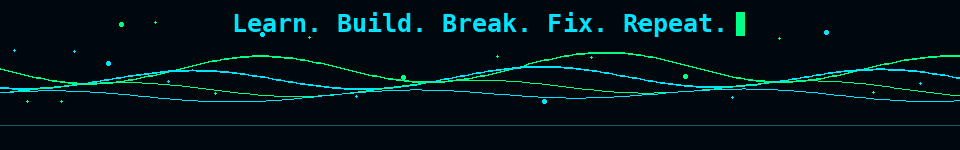

<!-- HERO -->

 

  

<!-- CONTRIBUTIONS -->
<h3><code>lokendra@github ~ $ ./contributions.sh</code></h3>

<table width="900">
<tr><td align="center">

</td></tr>
</table>

 

<!-- WHOAMI -->
<h3><code>lokendra@github ~ $ whoami</code></h3>

<table width="900">
<tr>
<td width="34%" align="center" valign="middle">

</td>
<td width="66%" align="center" valign="middle">

</td>
</tr>
</table>

 

<!-- STATS -->
<h3><code>lokendra@github ~ $ stats</code></h3>

<table width="900">
<tr><td align="center">

</td></tr>
</table>

 

<!-- TECH STACK -->
<h3><code>lokendra@github ~ $ tech-stack</code></h3>

<table width="900">
<tr><td align="center">

 

 

</td></tr>
</table>

 

<!-- CONNECT -->
<h3><code>lokendra@github ~ $ connect</code></h3>

&nbsp;

  

<!-- FOOTER -->

 
Live GitHub contribution data • refreshed automatically by GitHub Actions

