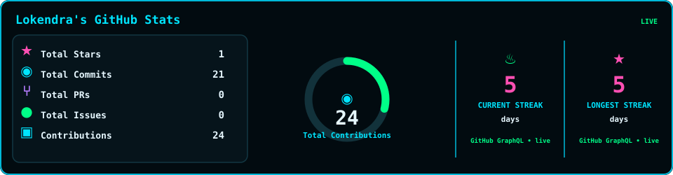
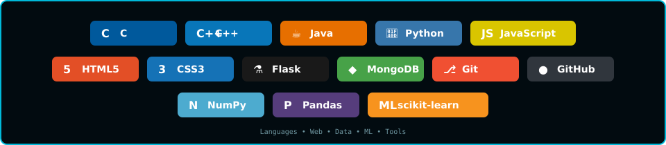

<!-- ========================= HERO ========================= -->

 

  

<!-- ====================== CONTRIBUTIONS ====================== -->
<h3><code>lokendra@github ~ $ ./contributions.sh</code></h3>

  

<!-- ========================= WHOAMI ========================= -->
<h3><code>lokendra@github ~ $ whoami</code></h3>
<table width="900" border="1" bordercolor="#00b9d9" cellpadding="12" cellspacing="0">
  <tr>
    <td width="34%" align="center" valign="middle">
      
    </td>
    <td width="66%" align="center" valign="middle">
      
    </td>
  </tr>
</table>

  

<!-- =========================== STATS =========================== -->
<h3><code>lokendra@github ~ $ stats</code></h3>

  

<!-- ======================== TECH STACK ======================== -->
<h3><code>lokendra@github ~ $ tech-stack</code></h3>

  

<!-- =========================== CONNECT =========================== -->
<h3><code>lokendra@github ~ $ connect</code></h3>
<table cellpadding="4" cellspacing="0">
  <tr>
    <td>
      
    </td>
    <td>
      
    </td>
  </tr>
</table>

 

GitHub contribution data is fetched through GitHub GraphQL and refreshed automatically by GitHub Actions.

